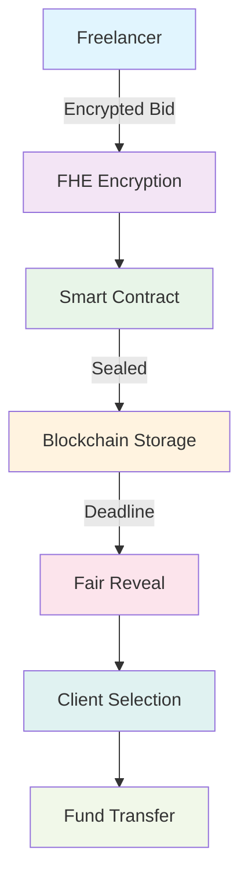

<div align="center">

# 🛡️ BidShield

### *The Future of Confidential Freelancer Bidding*

[](https://opensource.org/licenses/MIT)
[](https://fhevm.io)
[](https://ethereum.org)
[](https://vitejs.dev)

*Revolutionary blockchain-powered platform enabling confidential job proposals through fully homomorphic encryption*

</div>

---

## 🌟 What Makes BidShield Special?

BidShield isn't just another freelancing platform—it's a **paradigm shift** in how freelancers compete for projects. By leveraging cutting-edge **Fully Homomorphic Encryption (FHE)** and blockchain technology, we've created the world's first truly confidential bidding system.

### 🔐 The Problem We Solve

Traditional freelancing platforms expose your pricing strategy to competitors, leading to:
- **Race to the bottom** pricing wars
- **Unfair competition** based on undercutting
- **Loss of value** for skilled professionals
- **Transparency issues** in project selection

### ⚡ Our Solution

BidShield ensures **complete confidentiality** while maintaining **fair competition**:

```
🔒 Your Bid → FHE Encryption → Blockchain Seal → Fair Reveal
```

---

## 🚀 Key Features

<table>
<tr>
<td width="50%">

### 🛡️ **Confidential Bidding**
- Submit encrypted proposals that remain sealed until deadline
- Zero visibility to competitors during bidding period
- Complete privacy protection for your pricing strategy

### 🔐 **FHE Encryption**
- Military-grade fully homomorphic encryption
- Process encrypted data without decryption
- Unprecedented security for sensitive bid information

</td>
<td width="50%">

### ⛓️ **Blockchain Security**
- Smart contracts ensure bid integrity
- Immutable record of all transactions
- Decentralized and tamper-proof system

### ⚖️ **Fair Competition**
- Simultaneous bid reveal at deadline
- Merit-based selection process
- Transparent evaluation criteria

</td>
</tr>
</table>

---

## 🏗️ Architecture Overview



---

## 🛠️ Technology Stack

<div align="center">

| Category | Technology | Purpose |
|----------|------------|---------|
| **Frontend** | React 18 + TypeScript | Modern UI framework |
| **Build Tool** | Vite | Lightning-fast development |
| **Styling** | Tailwind CSS + shadcn/ui | Beautiful, responsive design |
| **Blockchain** | Ethereum (Sepolia) | Decentralized infrastructure |
| **Encryption** | FHEVM | Fully homomorphic encryption |
| **Wallet** | RainbowKit + Wagmi | Multi-wallet support |
| **Smart Contracts** | Solidity ^0.8.24 | On-chain logic |

</div>

---

## 🚀 Quick Start

### Prerequisites

- **Node.js** 18+ and npm
- **Git** for version control
- **Crypto wallet** (MetaMask, WalletConnect, etc.)
- **Sepolia ETH** for testing

### Installation

```bash
# Clone the repository
git clone https://github.com/zhenyuWu1987/bid-shield.git
cd bid-shield

# Install dependencies
npm install

# Start development server
npm run dev
```

### Environment Setup

Create a `.env.local` file with your configuration:

```env
VITE_CHAIN_ID=11155111
VITE_RPC_URL=your_rpc_url_here
VITE_WALLET_CONNECT_PROJECT_ID=your_project_id_here
```

---

## 🔄 How It Works

<div align="center">

### The BidShield Process

</div>

<table>
<tr>
<td width="33%" align="center">

### 1️⃣ **Browse & Discover**
- Explore verified client projects
- Filter by skills, budget, timeline
- Review detailed requirements

</td>
<td width="33%" align="center">

### 2️⃣ **Encrypt & Submit**
- Your bid encrypted locally
- Sealed in smart contract
- Zero visibility until deadline

</td>
<td width="33%" align="center">

### 3️⃣ **Fair Selection**
- All bids revealed simultaneously
- Merit-based evaluation
- Transparent decision process

</td>
</tr>
</table>

---

## 🔒 Security Features

<div align="center">

### Enterprise-Grade Protection

</div>

| Security Layer | Technology | Protection Level |
|----------------|------------|------------------|
| **Data Encryption** | AES-256 + FHE | Military Grade |
| **Blockchain Storage** | Ethereum Smart Contracts | Immutable |
| **Access Control** | Cryptographic Keys | Zero Trust |
| **Privacy** | Zero-Knowledge Proofs | Complete Anonymity |

---

## 📊 Smart Contract Features

Our `BidShield.sol` contract provides:

- **Job Management**: Create, manage, and complete projects
- **Sealed Bidding**: Encrypted bid submission and storage
- **Fair Reveal**: Simultaneous bid disclosure mechanism
- **Reputation System**: Track freelancer performance
- **Fund Escrow**: Secure payment handling
- **Dispute Resolution**: Built-in conflict resolution

---

## 🌐 Supported Networks

<div align="center">

| Network | Status | Chain ID | Purpose |
|---------|--------|----------|---------|
| **Sepolia** | ✅ Active | 11155111 | Testing & Development |
| **Mainnet** | 🚧 Coming Soon | 1 | Production |

</div>

---

## 🤝 Contributing

We welcome contributions! Here's how you can help:

### 🐛 Bug Reports
- Use GitHub Issues with detailed reproduction steps
- Include browser/device information
- Provide error logs when possible

### 💡 Feature Requests
- Describe the use case and expected behavior
- Consider security implications
- Propose implementation approach

### 🔧 Code Contributions
1. Fork the repository
2. Create a feature branch: `git checkout -b feature/amazing-feature`
3. Commit your changes: `git commit -m 'Add amazing feature'`
4. Push to the branch: `git push origin feature/amazing-feature`
5. Open a Pull Request

---

## 📈 Roadmap

<div align="center">

### What's Coming Next

</div>

- [ ] **Multi-chain Support** - Expand to Polygon, Arbitrum
- [ ] **Advanced FHE Operations** - Complex encrypted computations
- [ ] **Mobile App** - Native iOS/Android applications
- [ ] **API Integration** - Third-party service connections
- [ ] **Reputation System** - Enhanced freelancer profiles
- [ ] **Dispute Resolution** - Automated conflict resolution
- [ ] **Analytics Dashboard** - Project and earnings insights

---

## 📄 License

This project is licensed under the **MIT License** - see the [LICENSE](LICENSE) file for details.

---

## 🆘 Support & Community

<div align="center">

### Get Help

| Resource | Description | Link |
|----------|-------------|------|
| **Documentation** | Complete API and usage guide | [Coming Soon] |
| **Discord** | Community discussions | [Join Server] |
| **GitHub Issues** | Bug reports and feature requests | [Create Issue] |
| **Email** | Direct support | [Contact Us] |

</div>

---

## 🙏 Acknowledgments

- **FHEVM Team** for the revolutionary encryption technology
- **RainbowKit** for seamless wallet integration
- **shadcn/ui** for beautiful component library
- **Ethereum Foundation** for the decentralized infrastructure

---

<div align="center">

### Built with ❤️ for the Future of Freelancing

**BidShield** - Where privacy meets opportunity

[](https://github.com/zhenyuWu1987/bid-shield)
[](https://vercel.com)

</div>